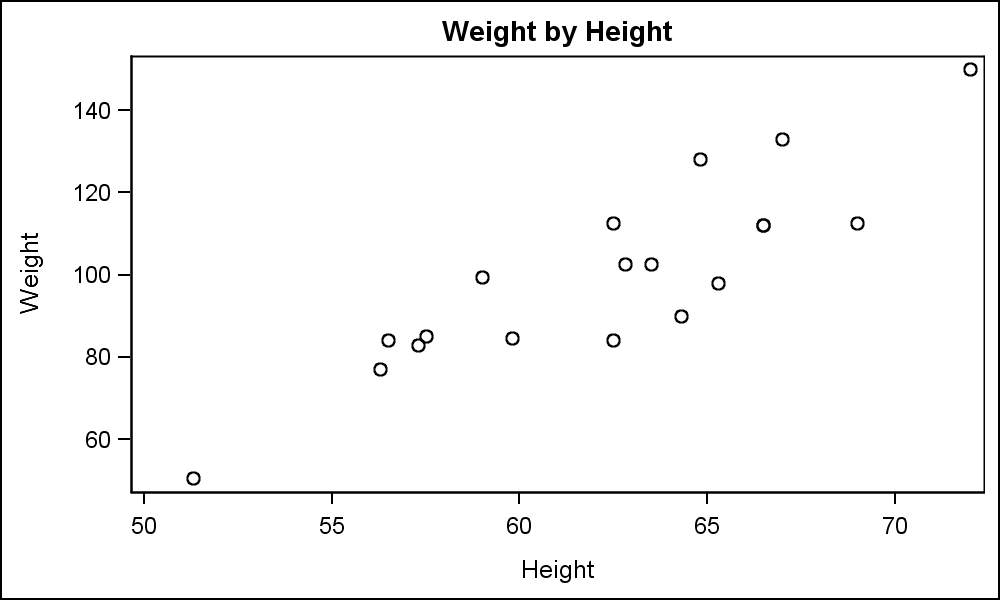

---
title:
- Introduction, PCA, Assignment 1-2
subtitle: |
    | (Neural Networks Implementation and Application Tutorial)
author:
- Tsimafei Prakapenka, Nicholas Gareth Jennigs
theme:
- Boadilla
date: 16th November 2022
aspectratio: 169
header-includes:
  - \AtBeginDocument{}
---

# Overview 

- Introduction
- Requirements, Materials, Assignments
- Previous assignment
- Linear Algebra, PCA
- Current assignment
- QA

# Hello

\centering

\large Who am I?

. . .

\LARGE Who are you?

{width=25px}

# Introduction

## Choose and answer at least two questions:

- On scale from 1-10 how proficient are you in programming, mathematics, and neural networks?
- What topics of Neural Networks excite you the most?
- What topics of Neural Networks excite you the least?
- What programming languages do you know?

## Also the following:
- Who is your groupmate?
- What are you expecting from tutorials?
- How best can the tutorial sessions be helpful to your needs?

# Requirements

::: frame
## Tutorial Requirements (exam admission)
- 60% of mandatory points (~10 assignments, 10 points each)
- Tutorial points only for exam admission (no final grade influence)
:::

\vspace{-0.1cm}

::: frame
## Tutorial Bonus Points
- ~2pts for extra exercises in the assignments (if available)
- up to 2pt for answering a question in a tutorial + presenting your HW solution
:::

\vspace{-0.5cm}

::: columns
:::: column
## Final Project
- None
::::

:::: column
## Transfer from last year
- Yes
- Assignments recommended (because of the exam)
::::
:::

# What's available

- Lectures by Prof. Klakow (onsite)
- Tutorials (online with Tsimafei and onsite with Nicholas)
- Corrected homework
- Consultations
  - Only in specific cases
  - By default **no** email and **no** personal chat
  - Ask questions during the lecture / tutorials
- Public forum (please use [Piazza](https://piazza.com/class/kvc3vzhsvh55rt))
  - Ask questions
  - Other students will also benefit from the answers
  - You can answer someone else's issue

<!--
# Cheating

. . .

\centering \footnotesize

no
-->

# Assignments

- Mandatory groups of 2 or 3
- Jupyter notebook templates
  - Assignment + solution in the same notebook
  - Use Google Colab or local runtime
  - Write solutions in Python files and import them
  - Submitted notebook must only contain your analysis and outputs
- Only one submission per group
  - Submit through Teams

# Dates / Times

- Lecture:
  - Tuesday 14:15-15:45
- Tutorials:
  - Tsimafei: Wednesday 16:15-17:45
  - Noon: Thursday 14:15-15:45
- Assignments
  - Released (usually) by Wednesday 08:00 (available in Teams)
  - Deadline (next) by Wednesday 08:00 (submit in Teams)
- Exam: TBD

# Tutorial Content

- Review of the topics covered in class + live coding sessions
- Presentation of the past assignment
- Discussing the current assignment

# Organization

\centering

Questions?

# Assignment 1

- Does anybody want to present solution?

. . .


- How long does it take? Any other feedback?

<!-- ## Feedback:
- Change \textcolor{red}{TODO} to \textcolor{green}{Solution}.
- Don't forget to write amount of work.
  - Useful for our estimates of difficulty. -->

# Linear Algebra Basics

Few definitions (+how are they implemented in Python/Numpy/PyTorch)

- Scalars
- Vectors
- Matrices
- Tensors

. . .

Identify the following objects (Python lists):

- `[5.0, 3.0]`
- `5.0`
- `[True]`
- `[[5, 1], [0, 4]]`
- `[[True, False], [False, True]]`
- `[ [[0,1], [0,1], [0,1]], [[0,1], [0,1], [0,1]] ]`

# Linear Algebra Basics

::: frame
## A few operations and properties involving matrices:

- Transpose
- Inverse
- Dot product (i.e. matrix multiplication)
  - $C=AB, C_{i,j} = \sum_{k} A_{i,k}B_{k,j}$
:::

::: frame
## Common Properties:

- $A(B+C) = AB + AC$
- $A(BC) = (AB)C$
- $AB \neq BA$
- $(AB)^T = B^TA^T$
:::

# Linear Algebra Basics


## Definitions:

> - Eigenvector, Eigenvalue
>   - $Av = \lambda v, v\neq \overrightarrow{0}$
> - Eigendecomposition
>   - $A = Q \cdot L \cdot Q^{-1}$
> - Singular value decomposition (SVD)
>   - $A = U \Sigma V^T$
> - Principal Component Analysis:
>   - Eigendecomposition or SVD of covariance matrix $W=\frac{A^TA}{n-1}$
<!-- Possible with eigendecomposition becauset A^TA is symmetric rectangular -->
>   - Assume ordering of \{eigen,singular\}values from highest to lowest
>   - Project to $k$ dimensions: $A_k = A Q_k$

# Linear Algebra Basics - True or False? {width=15px}

\qquad $A = \begin{pmatrix} 4 & 2 \\ 2 & 4 \end{pmatrix}$

1. Is $v_1 = (1, -1)$ an eigenvector of $A$?
2. Is $v_2 = (2, 1)$ an eigenvector of $A$?
3. Is $v_3 = (2, 2)$ an eigenvector of $A$?

# PCA

::: {}

\centering
{width=40%}

:::

## Questions {width=15px}
> - What will be the first principal component?
> - What is the motivation behind PCA?
> - What does it mean that we take only $k$ largest principal components?

<!-- 
```
1.   standardize data = raw data - mean / standard deviation of data
2.   M = covariant_matrix(standardize data)
3.   eigenvalues, eigenvectors = eig(M)
4.   feature_vector = select_n_highest_components(eigenvectors)
5.   projected data = standardized_data dot feature_vector
```
-->

<!-- # PCA

- Is it safe to say that the first component will always contain the most important information? {width=15px}

. . .

::: columns
:::: column

::::

:::: column

::::
::: -->

# Standardization

- Is not normalization! ($x' = \frac{x}{|x|}$)
- $X = \frac{X - \text{mean}(X)}{\text{std}(X)}$
- Compute either:
  - With Numpy: `X = (X-X.mean())/np.std(X)`
  - With Scikit: `StandardScaler().fit_transform(X)`

- Why do we need standardization for PCA? {width=15px}

# Assignment 2

- Any questions?

# Resources

1. Course Website: [lsv.uni-saarland.de/neural-networks-implementation-and-application-winter-2021-2022-2](https://www.lsv.uni-saarland.de/neural-networks-implementation-and-application-nnia-winter-2022-2023/)
2. Piazza: <https://piazza.com/class/l9so16qqvk34hu> 
3. Tutorial repository [https://github.com/tsimafeip/uds-nnia-tutorial-2223](https://github.com/tsimafeip/uds-nnia-tutorial-2223) (adapted from [last year edition](https://github.com/zouharvi/uds-nnia-tutorial) by Vilém Zouhar and  Noon Pokaratsiri Goldstein)
4. Lecture & tutorial teams channels
